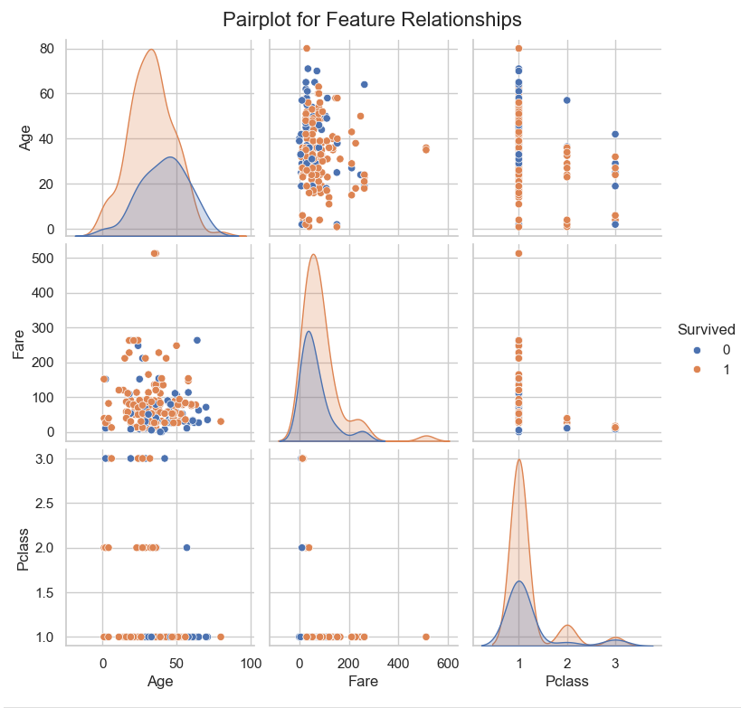
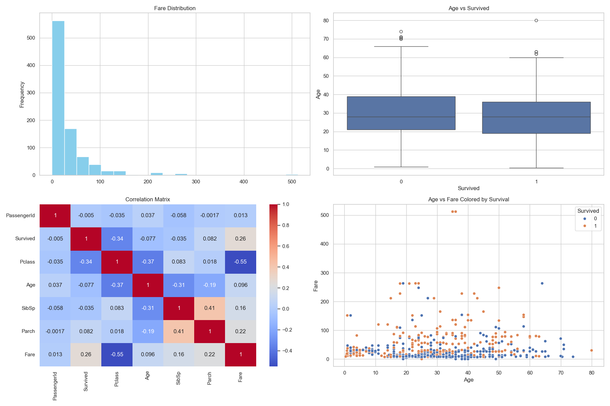

# ElevateLabs_AI-ML_TASK-02  
Exploratory Data Analysis (EDA) using the Titanic dataset

# 📊 Task 2: Exploratory Data Analysis (EDA)

## 🔍 Objective  
The objective of this task is to explore and analyze the Titanic dataset using statistical and visual techniques. The goal is to identify trends, patterns, and relationships among features that can inform future predictive modeling.

---

## 📁 Dataset

- **Name**: Titanic Dataset  
- **Source**: [Kaggle Titanic Dataset](https://www.kaggle.com/datasets/yasserh/titanic-dataset)  
- **File Used**: `Titanic-Dataset.csv`

---

## 🚀 Steps Performed

1. **Data Loading**: Loaded dataset using Pandas.
2. **Data Summary**:
   - Explored dataset structure, column types, and missing values.
   - Reviewed statistical summaries (mean, median, std, etc.).
3. **Visualization & Analysis**:
   - **Histograms** plotted for all numeric features to analyze distributions.
   - **Boxplot** drawn for `Age vs Survived` to study survival based on age.
   - **Correlation Heatmap** to identify linear relationships between features.
   - **Pairplot** created for `Age`, `Fare`, and `Pclass` against `Survived`.
4. **Combined Visual Summary**:
   - All major plots were combined and saved in one image file: `results.png`.

---

## 🛠 Tools & Libraries Used

- Python
- Jupyter Notebook
- Pandas, NumPy
- Matplotlib, Seaborn

---

## 📎 Result

### 🖼️ Individual Visualizations:
- 📦 ***Boxplot (Age vs Survived)***  
  

- 🔥 ***Correlation Heatmap***  
  

- 📊 ***Histogram of Numeric Features***  
  

- 🌀 ***Pairplot (Age, Fare, Pclass vs Survived)***  
  

### 🖼️ Combined Visual Summary:
- 🖼️ ***All key plots in one***  
  

---

